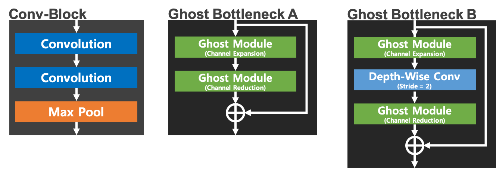
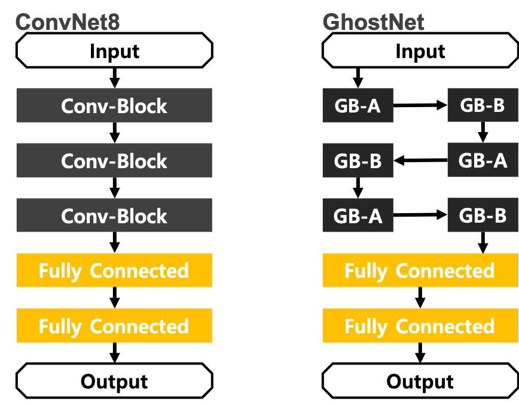

GhostNet: More Features from Cheap Operations
=====

TensorFlow implementation of GhostNet: More Features from Cheap Operations.  

## Performance

The performance is measured using below two CNN architectures.

<div align="center">
  <p></p>
  <p></p>  
  <p>Two Convolutional Neural Networks for experiment.</p>
</div>

| |ConvNet8|GhostNet|
|:---|:---:|:---:|
|Accuracy|0.99340|0.99370|
|Precision|0.99339|0.99373|
|Recall|0.99329|0.99357|
|F1-Score|0.99334|0.99364|

### ConvNet8
```
Confusion Matrix
[[ 979    0    0    0    0    0    0    1    0    0]
 [   0 1132    0    1    0    0    1    1    0    0]
 [   0    0 1029    0    0    0    0    3    0    0]
 [   0    0    1 1006    0    3    0    0    0    0]
 [   0    0    1    0  975    0    2    0    0    4]
 [   1    0    0    7    0  882    1    0    0    1]
 [   4    2    0    0    0    1  950    0    1    0]
 [   1    3    3    2    0    0    0 1018    1    0]
 [   3    0    1    1    0    1    0    0  966    2]
 [   0    0    0    1    6    2    0    3    0  997]]
Class-0 | Precision: 0.99089, Recall: 0.99898, F1-Score: 0.99492
Class-1 | Precision: 0.99560, Recall: 0.99736, F1-Score: 0.99648
Class-2 | Precision: 0.99420, Recall: 0.99709, F1-Score: 0.99565
Class-3 | Precision: 0.98821, Recall: 0.99604, F1-Score: 0.99211
Class-4 | Precision: 0.99388, Recall: 0.99287, F1-Score: 0.99338
Class-5 | Precision: 0.99213, Recall: 0.98879, F1-Score: 0.99045
Class-6 | Precision: 0.99581, Recall: 0.99165, F1-Score: 0.99372
Class-7 | Precision: 0.99220, Recall: 0.99027, F1-Score: 0.99124
Class-8 | Precision: 0.99793, Recall: 0.99179, F1-Score: 0.99485
Class-9 | Precision: 0.99303, Recall: 0.98811, F1-Score: 0.99056

Total | Accuracy: 0.99340, Precision: 0.99339, Recall: 0.99329, F1-Score: 0.99334
```

### GhostNet
```
Confusion Matrix
[[ 977    0    0    0    0    0    2    1    0    0]
 [   0 1131    1    1    0    0    1    1    0    0]
 [   1    1 1028    1    0    0    0    1    0    0]
 [   0    0    0 1008    0    1    0    1    0    0]
 [   0    0    2    0  972    0    4    0    1    3]
 [   1    0    0    7    0  882    1    0    0    1]
 [   4    0    3    1    0    1  947    0    2    0]
 [   0    2    3    0    0    0    0 1022    0    1]
 [   1    0    2    1    0    0    0    1  968    1]
 [   0    0    0    1    5    0    0    1    0 1002]]
Class-0 | Precision: 0.99289, Recall: 0.99694, F1-Score: 0.99491
Class-1 | Precision: 0.99735, Recall: 0.99648, F1-Score: 0.99691
Class-2 | Precision: 0.98941, Recall: 0.99612, F1-Score: 0.99276
Class-3 | Precision: 0.98824, Recall: 0.99802, F1-Score: 0.99310
Class-4 | Precision: 0.99488, Recall: 0.98982, F1-Score: 0.99234
Class-5 | Precision: 0.99774, Recall: 0.98879, F1-Score: 0.99324
Class-6 | Precision: 0.99162, Recall: 0.98852, F1-Score: 0.99007
Class-7 | Precision: 0.99416, Recall: 0.99416, F1-Score: 0.99416
Class-8 | Precision: 0.99691, Recall: 0.99384, F1-Score: 0.99537
Class-9 | Precision: 0.99405, Recall: 0.99306, F1-Score: 0.99355

Total | Accuracy: 0.99370, Precision: 0.99373, Recall: 0.99357, F1-Score: 0.99364
```

## Requirements
* Python 3.6.8  
* Tensorflow 1.14.0  
* Numpy 1.17.1  
* Matplotlib 3.1.1  

## Reference
[1] Kai Han et al. <a href="https://arxiv.org/abs/1911.11907">GhostNet: More Features from Cheap Operations
.</a> arXiv preprint arXiv:1911.119075 (2019).
